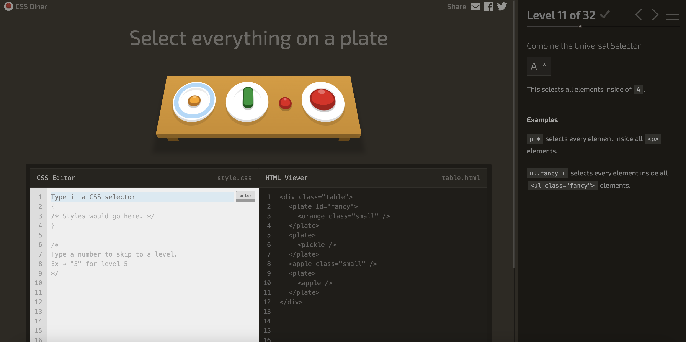

# Learning Log – Session 9 – 2/24 – Web

## What I learned today

2/24/26:

 and 
Two generic containers for grouping and styling. No semantic meaning.

 = block container (sections, cards, wrappers)

  <h2>Title</h2>
  
Content here...

 = inline container (highlight a word, style part of text)

The price is $99 today!

Block vs Inline: Real Examples
Block elements stack vertically, take full width:

, 
, <h1>, <ul>, <li>, <section>
Inline elements flow side by side, like words in a sentence:

, <a>, <strong>, 
That's why two  tags sit next to each other, not stacked. And why <li> items each get their own line.

Display Property
Type	Behavior	Default for
block	Full width, new line	
, 
, <h1>
inline	Flows with text, ignores width/height	, <a>, <strong>
inline-block	Inline flow, but accepts width/height	, <button>
none	Hides element completely	-

Centering Text:

ul {
    margin: 0 auto;
    width: 200px;
}

 Centering Trick
Since  is inline by default, margin: 0 auto won't center it.

Fix:

img {
  display: block;
  margin: 0 auto;
  width: 200px;
}

Pseudo-classes: Interactive Styles

/* When mouse hovers over a link */
a:hover {
  color: red;
  text-decoration: underline;
}

/* When an input is focused */
input:focus {
  border-color: blue;
  outline: none;
}

/* First and last child elements */
li:first-child { font-weight: bold; }
li:last-child { color: gray; }

/* Every other row (useful for tables/lists) */
tr:nth-child(even) {
  background-color: #f2f2f2;
}

/* Links that have been visited */
a:visited { color: purple; }

/* Target specific child positions */
li:nth-child(3) { color: red; }  /* third item */

CSS Variables:
:root {
  --babson-green: #006644;
  --accent-color: coral;
  --spacing: 20px;
}

h1 {
  color: var(--babson-green);
}

.highlight {
  background-color: var(--accent-color);
  padding: var(--spacing);
}

*OUTLINES DIFFERENT NAMES FOR DIFFERENT COLORS RATHER THAN NEEDING TO MEMORIZE THEM*

## Challenges I faced

## AI usage (if any)

## Questions for next time
